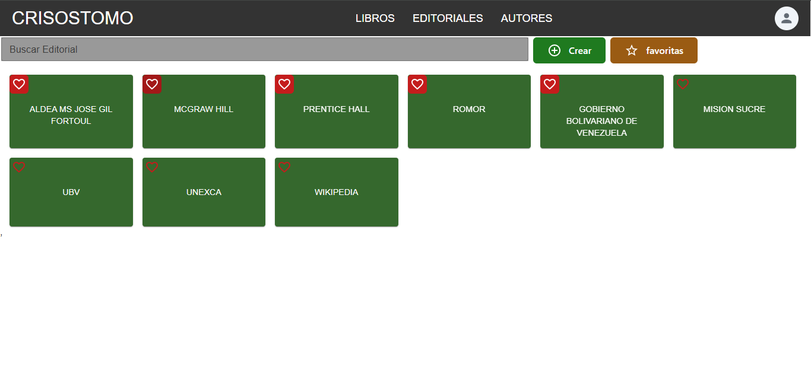

# CRISOSTOMO API

## Descripción
CRISOSTOMO es una API diseñada para gestionar libros, autores, editoriales y categorías. Utiliza FastAPI como framework web y PostgreSQL como base de datos. La API permite realizar operaciones CRUD (Crear, Leer, Actualizar, Eliminar) sobre libros, autores, editoriales y categorías, así como la búsqueda y filtrado de estos recursos. Esta aplicación está implementada siguiendo los principios de **Clean Architecture**. Este API es el núcleo de una biblioteca digital disenada e implementada eln la aldea universitaria de mision sucre Jose gil fortoul .

## Estructura del Proyecto
El proyecto está organizado en varias carpetas:

- **App**: Contiene la lógica de la aplicación, incluyendo controladores, servicios, entidades y acceso a datos.
- **API**: Define los controladores que manejan las solicitudes HTTP.
- **Domain**: Contiene las entidades y las interfaces de los repositorios.
- **Infrastructure**: Implementa la conexión a la base de datos y los DAOs (Data Access Objects).
- **Application**: Contiene la implementación de la lógica de la aplicación y los servicios que interactúan con los DAOs.
- **config**: Scripts de configuración y generación de directorios.

## Requisitos
- Python 3.12.4
- PostgreSQL

## Instalación

1. **Clonar el repositorio**:
   ```bash
   git clone <URL_DEL_REPOSITORIO>
   cd <NOMBRE_DEL_REPOSITORIO>
   ```

2. **Crear un entorno virtual** (opcional pero recomendado):
   ```bash
   python -m venv venv
   source venv/bin/activate  # En Linux o Mac
   venv\Scripts\activate  # En Windows
   ```

3. **Instalar las dependencias**:
   ```bash
   pip install -r requirements.txt
   ```

4. **Configurar la base de datos**: Asegúrate de que PostgreSQL esté instalado y configurado. Modifica la cadena de conexión en `GlobalValues.py` si es necesario.

5. **Crear los directorios necesarios**:
   Ejecuta el script `directoryGenerator.py` para crear los directorios donde se almacenarán los libros y logs.

## Uso

1. **Ejecutar la API**:
   ```bash
   uvicorn App.main:app --host 0.0.0.0 --port 8091 --reload
   ```

2. **Acceder a la documentación de la API**: Una vez que la API esté en funcionamiento, puedes acceder a la documentación interactiva en `http://localhost:8091/docs`.

## Endpoints

### Libros
- `GET /books/byID?id=<id>`: Obtiene un libro por su ID.
- `GET /books/getImagePreview?idBook=<id>`: Obtiene la imagen de vista previa de un libro.
- `GET /books/filter?param=<param>&value=<value>`: Filtra libros por un parámetro específico.
- `POST /books/createBook`: Crea un nuevo libro (requiere un archivo PDF).

### Autores
- `GET /authors`: Obtiene todos los autores.
- `GET /authors/byID?id=<id>`: Obtiene un autor por su ID.
- `POST /authors`: Crea un nuevo autor.

### Editoriales
- `GET /editorials`: Obtiene todas las editoriales.
- `GET /editorials/byID?id=<id>`: Obtiene una editorial por su ID.
- `POST /editorials`: Crea una nueva editorial.

### Categorías
- `GET /category/base`: Obtiene todas las categorías base.
- `GET /category/byParentId?parentId=<id>`: Obtiene categorías por ID de padre.
- `GET /category/byId?id=<id>`: Obtiene una categoría por su ID.

## Contribuciones
Las contribuciones son bienvenidas. Si deseas contribuir, por favor sigue estos pasos:
1. Haz un fork del repositorio.
2. Crea una nueva rama (`git checkout -b feature/nueva-caracteristica`).
3. Realiza tus cambios y haz commit (`git commit -m 'Añadir nueva característica'`).
4. Haz push a la rama (`git push origin feature/nueva-caracteristica`).
5. Abre un Pull Request.

## Contacto
Para más información, puedes contactar al autor del proyecto a través de [jarvis.realg@gmail.com].
